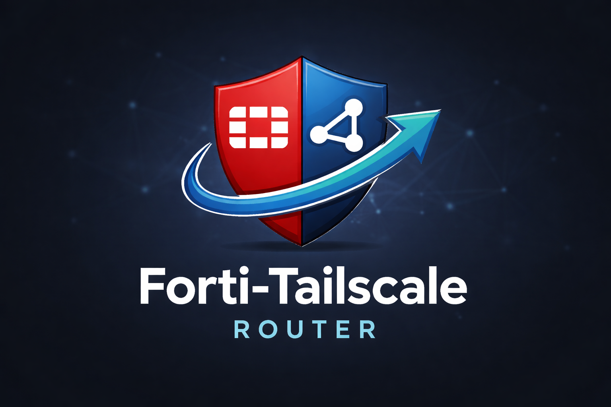

# Forti-Tailscale Router

<p align="center">


<h3>FortiGate VPN → Docker → Tailscale Exit Node</h3>

A lightweight container that connects to a **FortiGate SSL VPN** and exposes the connection as a **Tailscale Exit Node**, allowing devices in your tailnet to securely route traffic through the VPN.

</p>

---

# Overview

**Forti-Tailscale Router** is a containerized gateway that bridges **FortiGate SSL VPN** and **Tailscale**.

Instead of advertising internal subnets, the container operates as a **Tailscale Exit Node**, allowing tailnet devices to send their traffic through the FortiGate VPN tunnel.

This enables secure access to the internet or corporate resources through the VPN from anywhere in your tailnet.

The container image is published on **Quay** and can be pulled directly.

Image repository:

```
https://quay.io/repository/ajayos/forti-tailscale-router
```

---

# Architecture

```
Tailnet Devices
      │
      │
Tailscale Network
      │
      │
┌─────────────────────────────┐
│   Forti-Tailscale Router    │
│                             │
│   tailscaled                │
│   openfortivpn              │
│   vpn-monitor               │
│   dashboard                 │
└─────────────────────────────┘
      │
      │
FortiGate SSL VPN
      │
      │
Internet / Corporate Network
```

---

# Container Image

The container image is hosted on **Quay**.

Pull the image:

```bash
docker pull quay.io/ajayos/forti-tailscale-router:latest
```

Repository:

```
quay.io/ajayos/forti-tailscale-router
```

---

# Features

• FortiGate SSL VPN support using `openfortivpn`
• Tailscale integration
• Runs as a **Tailscale Exit Node**
• Automatic VPN reconnect
• Tailscale SSH support
• Web dashboard for monitoring
• Docker-based deployment
• Environment variable configuration
• Tailnet peer monitoring
• Live VPN traffic visualization

---

# Use Cases

• Remote developer environments
• Secure internet routing via corporate VPN
• Private infrastructure access
• DevOps internal networking
• Homelab VPN gateway
• Secure remote browsing through VPN

---

# Requirements

Before running the container ensure you have:

• Docker installed
• A FortiGate VPN account
• A Tailscale account
• A Tailscale authentication key

Install Docker:

```
https://docs.docker.com/get-docker/
```

Generate a Tailscale auth key:

```
https://login.tailscale.com/admin/settings/keys
```

---

# Run Container

Pull and run the container directly from **Quay**.

Example deployment:

```bash
docker run -d \
--name forti-tailscale-router \
--cap-add=NET_ADMIN \
--device /dev/net/tun \
--device /dev/ppp \
--privileged \
-v tailscale-state:/var/lib/tailscale \
-p 8080:8080 \
-e FORTI_HOST=1.2.3.4 \
-e FORTI_PORT=443 \
-e FORTI_USERNAME=username \
-e FORTI_PASSWORD=password \
-e FORTI_CERT=abcdef123456 \
-e TAILSCALE_AUTHKEY=tskey-xxxxxxxx \
-e TAILSCALE_HOSTNAME=forti-exit-node \
quay.io/ajayos/forti-tailscale-router:latest
```

---

# Configuration

The container is configured entirely using **environment variables**.

| Variable           | Description                               |
| ------------------ | ----------------------------------------- |
| FORTI_HOST         | FortiGate VPN hostname or IP              |
| FORTI_PORT         | VPN port (usually 443)                    |
| FORTI_USERNAME     | VPN login username                        |
| FORTI_PASSWORD     | VPN password                              |
| FORTI_CERT         | FortiGate trusted certificate fingerprint |
| TAILSCALE_AUTHKEY  | Tailscale authentication key              |
| TAILSCALE_HOSTNAME | Node hostname in tailnet                  |

Example configuration:

```
FORTI_HOST=vpn.company.com
FORTI_PORT=443
FORTI_USERNAME=devuser
FORTI_PASSWORD=password
FORTI_CERT=abcdef123456
TAILSCALE_AUTHKEY=tskey-xxxxx
TAILSCALE_HOSTNAME=forti-exit-node
```

---

# Enable Exit Node

Once the container is running, enable the exit node from your device.

Using CLI:

```
tailscale up --exit-node=forti-exit-node
```

Or enable it through the **Tailscale Admin Console**.

Traffic path becomes:

```
Device → Tailnet → Exit Node → FortiGate VPN
```

---

# Dashboard

A built-in monitoring dashboard is available.

Open in your browser:

```
http://SERVER_IP:8080
```

Dashboard displays:

• VPN connection status
• Tailscale peer list
• Tailnet device status
• VPN traffic graph
• system information

---

# Logs

View runtime logs with:

```bash
docker logs forti-tailscale-router
```

Logs include:

• VPN connection attempts
• auto reconnect events
• tailscale network status
• dashboard activity

---

# Troubleshooting

### VPN Not Connecting

Check container logs:

```
docker logs forti-tailscale-router
```

Verify:

• VPN host
• username/password
• certificate fingerprint

---

### Tailscale Not Connecting

Verify the auth key:

```
TAILSCALE_AUTHKEY
```

Ensure the node appears in:

```
https://login.tailscale.com/admin/machines
```

---

# Security Notes

Do **not commit VPN credentials** to source control.

Recommended practices:

• Use environment variables
• Use Docker secrets in production
• Rotate Tailscale auth keys regularly
• Restrict dashboard port access

---

# Contributing

Pull requests and improvements are welcome.

Possible areas of improvement:

• enhanced dashboard UI
• advanced network monitoring
• better traffic metrics
• multi-VPN configuration

---

# License

Apache 2.0 License

---

# Author

Created by **Ajay OS**

Website:

```
https://ajayos.com
```

---

# Container Registry

Image hosted on **Quay Container Registry**:

```
https://quay.io/repository/ajayos/forti-tailscale-router
```

---

# Support

If you find this project useful, consider giving it a ⭐ on GitHub.
